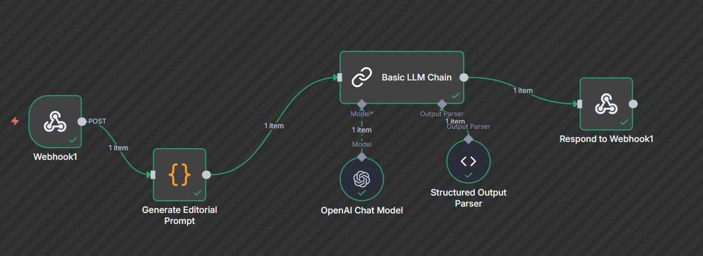

# 🪄 Arabic Editorial AI System — Streamlit + n8n + LLM Automation

## 📖 Overview

This project is an end-to-end **AI-powered editorial and translation system** that integrates:

* **Streamlit** (Frontend UI)
* **n8n** (Workflow Orchestration)
* **LLMs** (Editorial rewriting + multilingual translation)

It allows users to rewrite Arabic news articles using three editorial styles, then instantly translate the edited output into **English** or **Hebrew** — all through a clean, interactive frontend.

### ✨ Core Features

✔ Rewrite Arabic news based on **3 editorial identities**
✔ Display structured, color-coded output (العنوان، المقدمة، التفاصيل…)
✔ Professional English & Hebrew translation
✔ Fully integrated Streamlit → n8n automation
✔ Uses latest OpenAI + OSS LLM models

---

# 📰 Editorial Policies

* 🎓 **Najah Media** — Academic & Objective
* 🇵🇸 **Gaza TV** — National, Emotional, Human-Centered
* 🗞️ **Najah News** — Direct, Journalistic, Factual

Users select a policy and the system returns a rewritten, structured version of the input article.

---

# 🔧 System Architecture

```
Streamlit (Frontend)
     ↓  POST /edit-article
n8n Workflow (Editing)
     ↓  LLM (4o-mini)
     ↓  JSON Structured Output
Streamlit UI (Display)
     ↓  POST /translate
n8n Workflow (Translation)
     ↓  Translation LLM (GPT-OSS-20B)
     ↓  JSON Structured Output
Streamlit UI (Comparison)
```

---

# 🧩 Workflow 1: Editorial Rewriting (n8n)

### **Workflow Name:** `Arabic Editorial AI System`

### 🔗 Workflow Structure

`Webhook → Generate Editorial Prompt → Basic LLM Chain → Structured Output Parser → Respond To Webhook`

📸


### 📝 Example Output

```json
{
  "التصنيف": "خبر محلي",
  "العنوان": "وزارة الصحة تطلق حملة لتطعيم الأطفال ضد الدفتيريا",
  "المقدمة": "أعلنت وزارة الصحة الفلسطينية اليوم بدء حملة وطنية لتطعيم الأطفال ضد مرض الدفتيريا...",
  "التفاصيل": "تهدف الحملة إلى تعزيز المناعة العامة للأطفال ضمن البروتوكول الصحي الفلسطيني...",
  "الخاتمة": "دعت الوزارة الأهالي إلى مراجعة أقرب مركز صحي لاستكمال الجرعات المطلوبة.",
  "الكلمات_المفتاحية": ["الصحة", "تطعيم", "الأطفال", "فلسطين"]
}
```

---

# 🧩 Workflow 2: Multilingual Translation (n8n)

### **Workflow Name:** `Arabic Editorial Translation Subflow`

### 🔗 Workflow Structure

`Webhook → Translating Prompt → Translation LLM → Basic LLM Chain → Respond To Webhook`

This workflow receives the edited Arabic article and translates it into:

* 🇬🇧 **English**
* 🇮🇱 **Hebrew**

### 📝 Output Structure

```json
{
  "category": "",
  "title": "",
  "introduction": "",
  "details": "",
  "conclusion": "",
  "keywords": []
}
```

---

# 🖥️ Streamlit Frontend

The Streamlit UI provides:

* ✔ Arabic text input area
* ✔ Editorial policy selection
* ✔ One-click rewriting
* ✔ One-click translation (EN/HE)
* ✔ Side-by-side comparison
* ✔ Color-coded article sections

📸


---

# 🧠 AI Models Used

| Component           | Model                  |
| ------------------- | ---------------------- |
| Editorial Rewriting | `gpt-4o-mini`          |
| Translation         | `gpt-oss-20b`          |
| Output Parser       | JSON Structured Parser |

---

# 🌍 Translation Expansion

Following the successful development of the editorial automation system, the next phase focuses on extending the platform to support **high-quality multilingual translation directly from the user interface.**

### 🎯 Objective

Translate every AI-edited news article into **English** and **Hebrew**, while preserving journalistic tone and structure.

### 🔧 Requirements

* ✔ Translation buttons in Streamlit (EN / HE)
* ✔ `/translate` webhook inside n8n
* ✔ High-quality translation model selected from research
* ✔ Natural, newsroom-ready translation
* ✔ Accurate names, dates, and locations
* ✔ JSON structure preserved
* ✔ Same UI formatting as Arabic version

This transforms the system from an **Arabic-only editor** into a **multilingual AI newsroom engine**.

---

## 🎥 Project Demo Video

You can watch a full walkthrough of how the **Arabic Editorial AI System** works —  
including **n8n workflow setup**, **Streamlit interface**, and **live text processing demo** —  
in the following video:

🔗 **Watch here:** [Project Demo Video](https://drive.google.com/file/d/1nzPaUUqq6GJ4HIuQ6jAeXnrJTjC1p9eS/view?usp=drive_link)

---

## 👨‍💻 Author

**Name:** Osama AbuReesh
**GitHub:** [OsamaAbuReesh](https://github.com/OsamaAbuReesh)  
**LinkedIn:** [LinkedIn Profile](https://www.linkedin.com/in/o-abureesh/)

---
